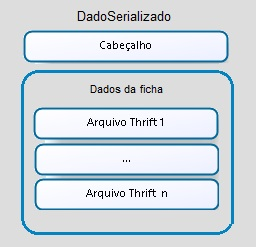

#### Lote

Um lote é um conjunto de arquivos de dados. 

####Arquivo de dados

Cada arquivo de dados representa uma ficha.

Os arquivos de dados possuem a mesma macro estrutura, referenciada como camada de transporte. A macro estrutura do arquivo de dados independe do tipo da ficha.

Quando a integração é realizada através do **Apache Thrift** os arquivos de dados devem ser compactados com extensão ".esus". Cada arquivo representa um dadoTransport serializado através do [TBinaryProtocol](https://github.com/apache/thrift/blob/0.9.2/lib/java/src/org/apache/thrift/protocol/TBinaryProtocol.java).

A estrutura da Camada de Transporte é ilustrada na imagem abaixo:

 *Camada de transporte - Macro estrutura de um arquivo de dados*

A seguir é apresentada definição de cada um dos elementos da Camada de transporte. Por sua vez, o dicionário de dados da Camada de transporte é apresentado no documento .

####1. uuidDadoSerializado

Este campo indica o UUID do dado serializado.

####2. tipoDadoSerializado

Este campo indica o tipo da ficha contida no dado serializado.

####3. cnesDadoSerializado

Este campo indica o CNES da Unidade de saúde que gerou a fichac ontida no dado serializado.

####4. codIbge

Este campo indica o código do IBGE do município que gerou a ficha contida no dado serializado.

####5. ineDadoSerializado

Este campo indica o código do equipe de sapude que gerou a ficha contida no dado serializado.

####6. numLote

Este campo indica o número do lote ao qual o arquivo de dados (camada de transporte) pertence.

####7. dadoSerializado

Este campo contém a serialização dos dados de uma ficha. A serialização é feita utilizando o [TBinaryProtocol](https://github.com/apache/thrift/blob/0.9.2/lib/java/src/org/apache/thrift/protocol/TBinaryProtocol.java).

O dado serializado possui dois componentes: Cabeçalho e Dados da ficha.

 *Estrutura do dado serializado*

O dicionário de dados do **Cabeçalho** é definido no documento ;

Os **Dados da ficha** devem ser estruturados em arquivos Thrift conforme descrito no documento .

Os dicionários de dados de cada tipo de ficha são definidos nos documentos:

- ;
- ;
- ;
- ;
- ;
- ;
- ;
- ;
- ;
- ;
- ;
- .

####8. remetente 

No caso do software de terceiro o campo remetente será igual ao campo Originadora.

####9. originadora

Este campo indica qual instalação gerou/enviou o dado. Estas informações são representadas por um [DadoInstalacao](#dadoinstalacao).

####10. versao

O campo versão deve ser informado conforme definido no documento .

