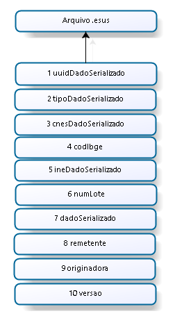

#### Lote
Um lote é um conjunto de arquivos de dados. 

####Arquivo de dados

Cada arquivo de dados representa uma ficha.

Os arquivos de dados possuem a mesma macro estrutura, referenciada como camada de transporte. A macro estrutura do arquivo de dados independe do tipo da ficha.

Quando a integração é realizada através do **Apache Thrift** os arquivos de dados devem ser compactados com extensão ".esus". Cada arquivo representa um dadoTransport serializado através do [TBinaryProtocol](https://github.com/apache/thrift/blob/0.9.2/lib/java/src/org/apache/thrift/protocol/TBinaryProtocol.java).

Cada arquivo ".esus" contém apenas uma ficha, conforme descrito no documento  e ilustrado na imagem abaixo:

 *Camada de transporte (Macro estrutura de um arquivo .esus)*

#### DadoSerializado

Cada ficha pode ser composta por vários arquivos, conforme descrito no documento .
Os dados das fichas exportadas devem ser estruturados conforme descrito no dicionário de dados de cada uma das fichas. Além destas informações cada ficha apresenta um cabeçalho (HeaderTransport). Os dados de cada ficha devem ser serializados através do TBinaryProtocol e inseridos no campo dadoSerializado do arquivo ".esus" da respectiva ficha. 

- ;
- ;
- ;
- ;
- ;
- ;
- ;
- ;
- ;
- ;
- ;
- ;
- .

#### Remetente e originadora

No caso do software de terceiro o campo remetente será igual ao campo originadora, que indica qual instalação gerou/enviou o dado. Estas informações são representadas por um [DadoInstalacao](#dadoinstalacao).

#### Versão

O campo versão deve ser informado conforme definido no documento .

